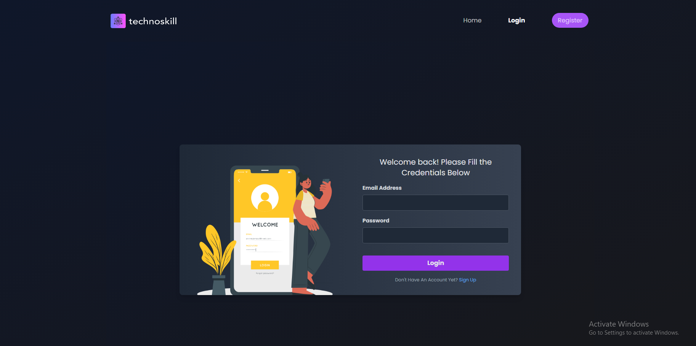
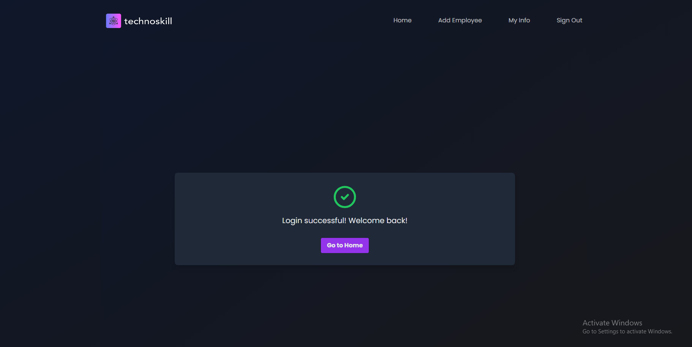
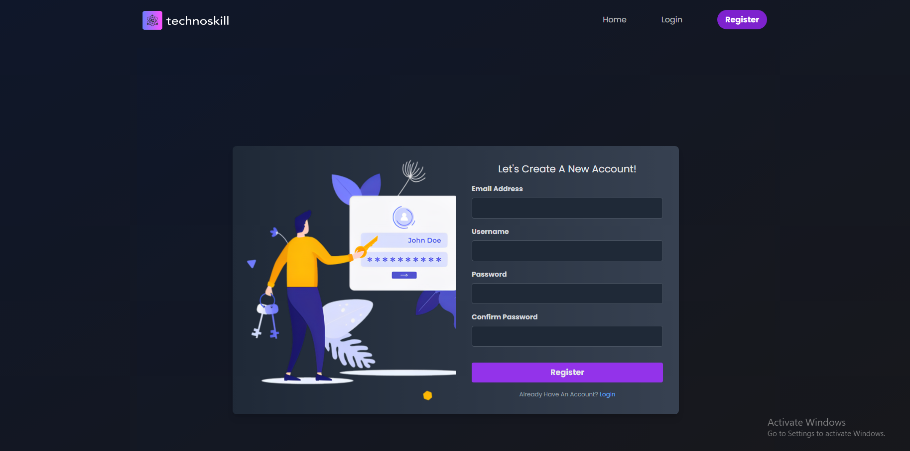
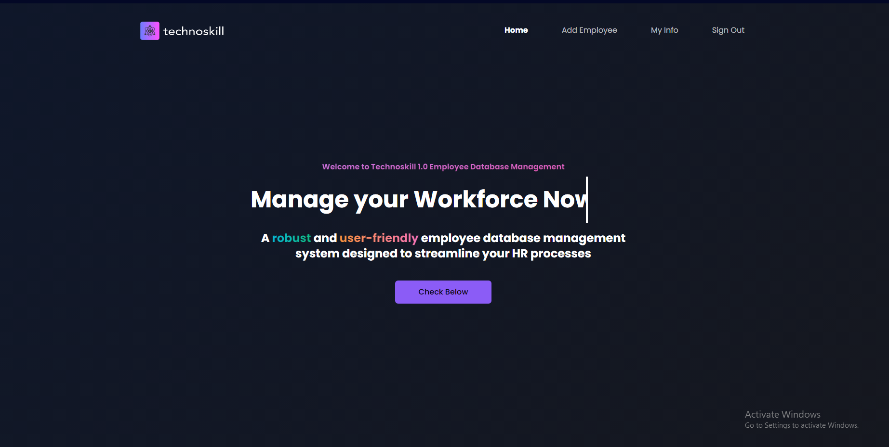
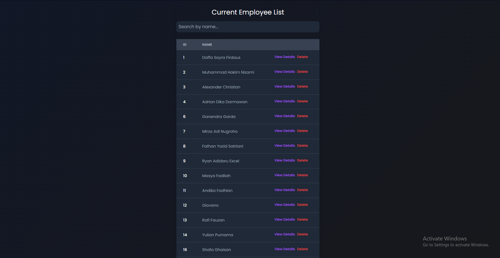
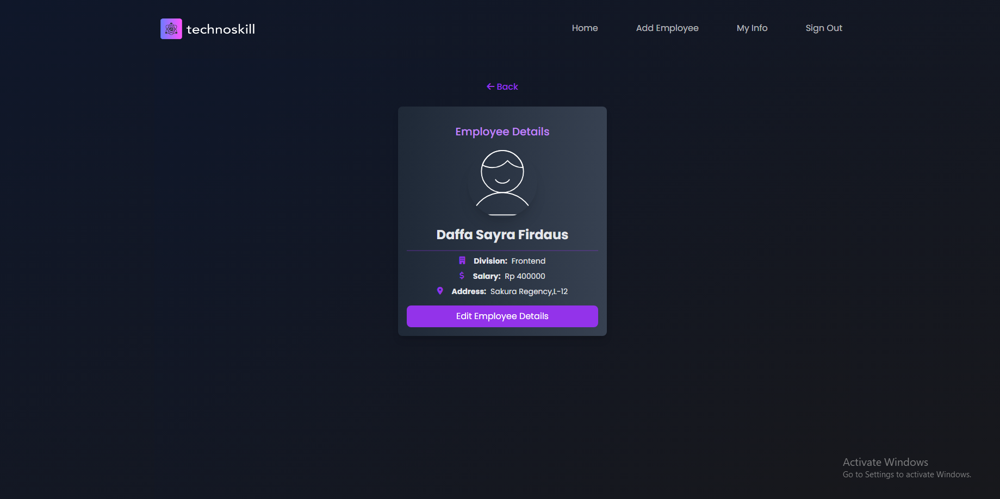
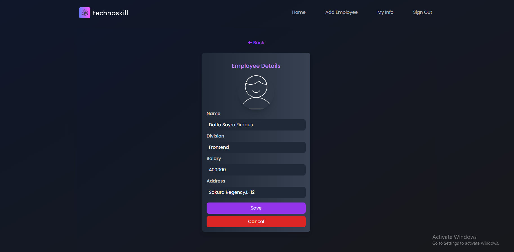
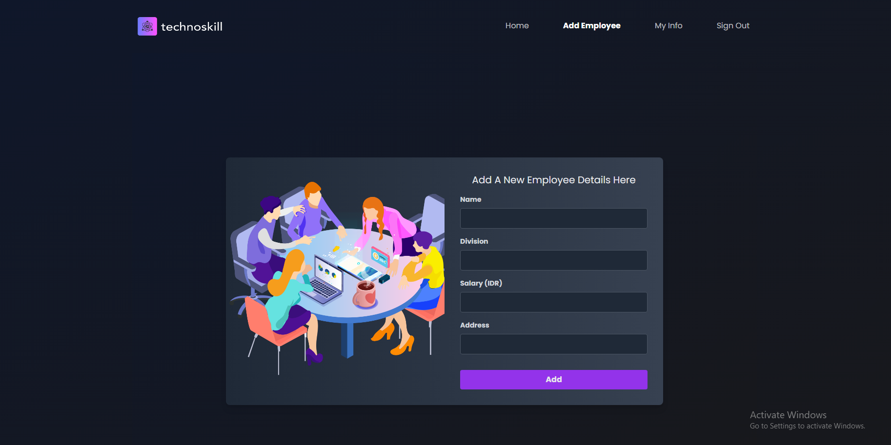
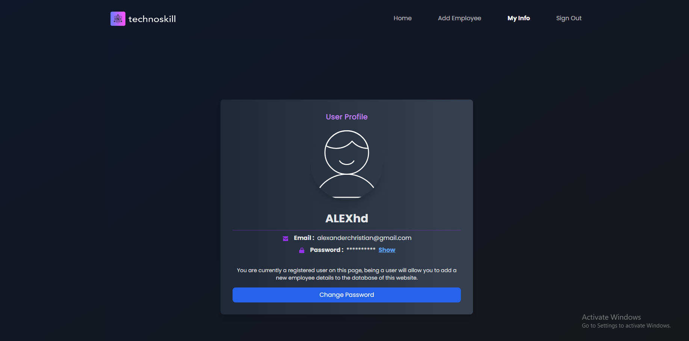
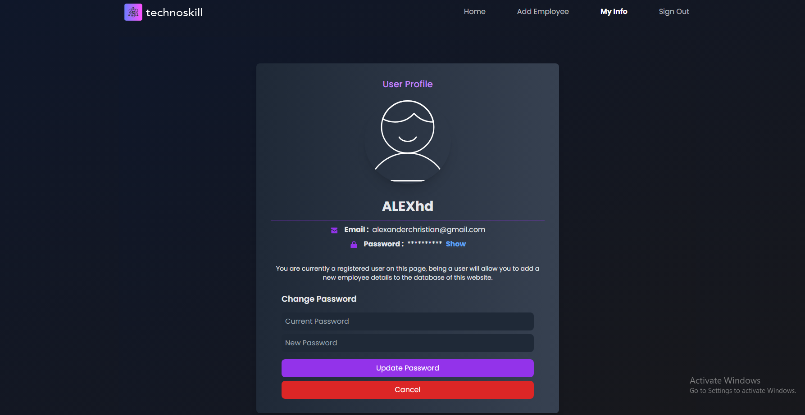

# Welcome to our WEBSITE for Technoskill 1.0
## This Project Is Made By
### - Daffa Sayra Firdaus - Teknik Komputer 2023
### - Alexander Christhian - Teknik Komputer 2023
### - Adrian Dika Darmawan - Teknik Komputer 2023

## About Our Website
### Proyek kami merupakan sebuah website database management yang berguna untuk memudahkan proses pengerjaan HR dengan UI yang user friendly.

## Fitur - Fitur Utama :
### Login page
Login page merupakan menu pertama yang berada pada web ini dan berguna untuk login sebuah user yang telah meregister ke web tersebut.

### Register page
Register page merupakan menu yang berguna untuk meregister suatu user baru yang ingin menggunakan website ini.

### Home Page
Home page merupakan menu utama yang berada pada web ini dan berisikan data - data yang akan dari employee yang telah diinput oleh user. Data - data yang telah diinput dapat dilihat oleh user dan dapat di search untuk mempermudah user untuk mencari data yang sesuai. Kita juga dapat menghapus data yang sudah 

### Detail Employee Page
Page ini merupakan page yang menampilkan detail dari data salah satu employee yang telah masuk ke database. Pada bagian ini user juga dapat mengedit data dari employee tersebut ataupun menghapus employee tersebut.

### Add Employee Page
Add Employee ini berfungsi untuk menambahkan employee baru ke dalam database. User dapat memasukkan data - data dari employee tersebut lalu data tersebut akan tersimpan ke dalam database.

### My Info Page
My Info ini berfungsi untuk menampilkan informasi mengenai akun yang dipakai sekarang oleh user tersebut. Pada My Info ini user juga dapat mengganti password dari akun yang sedang dipakai.

### Sign Out
Sign Out ini berfungsi untuk sign out dari akun yang sedang digunakan oleh user.
