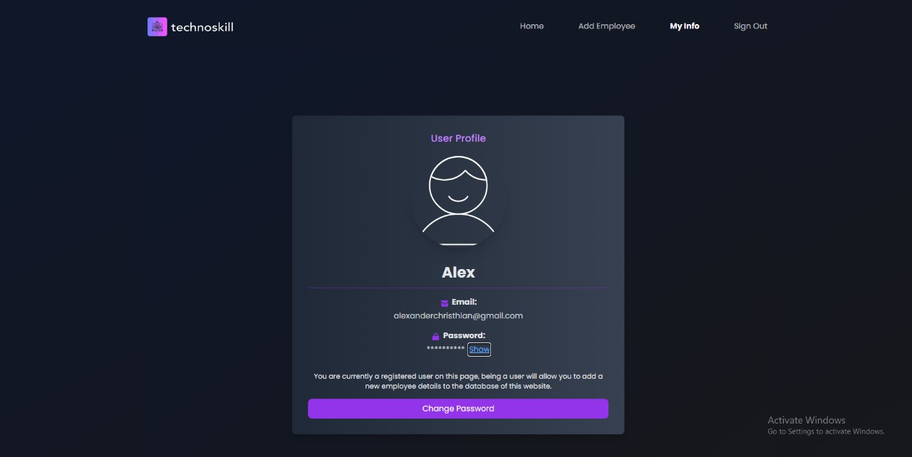

# Welcome to our WEBSITE for Technoskill 1.0
## This Project Is Made By:
- Daffa Sayra Firdaus - Teknik Komputer 2023
- Alexander Christhian - Teknik Komputer 2023
- Adrian Dika Darmawan - Teknik Komputer 2023

## About Our Website
Proyek kami merupakan sebuah website _database management_ yang berguna untuk memudahkan proses pengerjaan HR dengan UI yang _user-friendly_.

# Fitur - Fitur Utama :
### _Login page_
_Login page_ adalah menu pertama pada web ini yang digunakan _user_ yang teregister untuk login ke web tersebut.

### _Register page_
_Register page_ adalah menu yang digunakan untuk meregister _user_ baru yang ingin menggunakan website ini.

### _Home Page_
_Home page_ adalah menu utama pada web ini yang berisikan data-data _employee_ yang telah diinput oleh _user_. Data-data yang telah diinput dapat dilihat dan di_search_ ataupun di_sort_ sehingga mempermudah _user_ untuk mencari data yang sesuai. Kita juga dapat menghapus data yang sudah ditambahkan ke database. 

_Home page_ juga akan memberikan notifikasi kepada _user_ untuk melakukan _sign in_ jika _user_ tersebut ingin melihat/menginput data dalam web ini.

### Detail Employee Page
Page ini merupakan page yang menampilkan detail dari data salah satu employee yang telah masuk ke database. Pada bagian ini user juga dapat mengedit data dari employee tersebut ataupun menghapus employee tersebut.

### Add Employee Page
Add Employee ini berfungsi untuk menambahkan employee baru ke dalam database. User dapat memasukkan data - data dari employee tersebut lalu data tersebut akan tersimpan ke dalam database.

### My Info Page
My Info ini berfungsi untuk menampilkan informasi mengenai akun yang dipakai sekarang oleh user tersebut. Pada My Info ini user juga dapat mengganti password dari akun yang sedang dipakai.

### Sign Out
Sign Out ini berfungsi untuk sign out dari akun yang sedang digunakan oleh user.

# _Error Handling_
Kami mengimplementasikan beberapa _Error Handling_ dalam proyek kami, sebagaimana seperti contoh-contoh berikut:

### _Existing Data_
Penerapan _error handling_ ini muncul ketika pengguna menginput data yang sudah teregistrasi.

### Menggunakan email yang telah terdaftar
Penerapan Penerapan _error handling_ ini muncul ketika pengguna menginput email yang sudah teregistrasi.

### Password yang tidak cocok
Penerapan _error handling_ ini muncul ketika pengguna menginput password yang berbeda pada kolom verifikasi kecocokan password.

### Login dengan data yang salah
Penerapan _error handling_ ini muncul ketika pengguna menginput data yang salah ketika ingin login.

# _Responsive_
UI web kami adaptif terhadap ukuran layar handphone sehingga web kami terjaga dalam konsistensi kerapihan _layout_ web kami dalam perangkat lain. Berikut tampilan-tampilannya:

